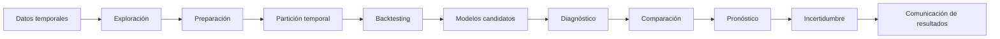

<div align="center">

# 📈 Series de Tiempo    https://meet.google.com/jvi-ixkc-nox

### Análisis, modelado y pronóstico principalmente con Python

**Wilson Sandoval Rodríguez**

*Forecasting · Nowcasting · Anomalías · ARIMA · SARIMA · SARIMAX · Prophet · Machine Learning · VAR/VEC · Deep Learning*

</div>

---

## 🚀 Acceso rápido

| Recurso | Descripción |
|---|---|
| 📘 [Programa del curso](01_programa/programa_curso.md) | Objetivos, contenidos y organización general |
| 🐍 [Notebooks de Python](Notebooks-Python/) | Todos los notebooks, ejercicios y ejemplos aplicados |
| 💾 [Datos](03_datos/) | Bases de datos utilizadas durante el curso |
| 🧪 [Evaluación de modelos](Notebooks-Python/04_validacion_backtesting_metricas.ipynb) | Ejemplo de evaluación y comparación temporal |
| 🎓 [Proyecto final](05_proyecto_final/) | Orientaciones y criterios de la entrega final |

---

## 🎯 Sobre el curso

El curso de **Series de Tiempo** introduce los fundamentos y las principales metodologías para analizar, modelar y pronosticar fenómenos que evolucionan a través del tiempo.

El enfoque es principalmente **práctico y aplicado en Python**. A lo largo del curso se combinan conceptos estadísticos, visualización, programación y evaluación predictiva, utilizando datos provenientes de diferentes contextos como economía, finanzas, salud, climatología, meteorología, gestión de riesgos y otros campos de aplicación. El material en R se conserva únicamente como apoyo opcional.

Más que aprender modelos de manera aislada, el curso busca desarrollar un **flujo completo de trabajo para problemas de forecasting**, desde la comprensión de los datos hasta la validación y comunicación de los resultados.

---

## 🧭 Flujo de trabajo del curso



> **Idea central:** en series de tiempo no basta con obtener un buen ajuste histórico. El modelo debe evaluarse respetando el orden temporal y demostrando capacidad de generalización hacia datos futuros.

---

## 🎓 Resultados de aprendizaje

Al finalizar el curso, el estudiante estará en capacidad de:

- Identificar **tendencia, estacionalidad, ciclos, ruido y cambios estructurales** en una serie temporal.
- Preparar datos temporales mediante **resampling, imputación, transformaciones y tratamiento de valores atípicos**.
- Diseñar esquemas apropiados de **entrenamiento, validación y prueba temporal**.
- Implementar estrategias de **backtesting** y validación con ventana móvil.
- Comparar modelos mediante métricas como **MAE, RMSE, MAPE y MASE**.
- Construir e interpretar modelos **ETS, ARIMA, SARIMA y SARIMAX**.
- Incorporar variables externas mediante modelos de **regresión dinámica**.
- Aplicar modelos modernos como **Prophet** y algoritmos de **Machine Learning**.
- Analizar **series múltiples, datos tipo panel y sistemas multivariados**.
- Introducir modelos **VAR, cointegración y VEC**.
- Comprender los fundamentos del **pronóstico probabilístico** y la incertidumbre predictiva.
- Explorar aplicaciones de **Deep Learning** y detección de anomalías en series de tiempo.
- Seleccionar modelos de manera crítica según el problema, los datos y el horizonte de pronóstico.

---

## 🗺️ Ruta de aprendizaje

| Semana | Tema | Material principal |
|:---:|---|---|
| **1** | Formulación del problema, variable objetivo, frecuencia y horizonte | [Fundamentos](Notebooks-Python/01_fundamentos_series_tiempo.ipynb) |
| **2** | Exploración temporal: tendencia, estacionalidad, ciclos y anomalías | [Fundamentos](Notebooks-Python/01_fundamentos_series_tiempo.ipynb) |
| **3** | Preparación de datos: resampling, faltantes, atípicos y transformaciones | [Preparación](Notebooks-Python/03_preparacion_datos_temporales.ipynb) · [Imputación](Notebooks-Python/03_imputacion_avanzada.ipynb) |
| **4** | Baselines, partición temporal, backtesting y métricas | [Evaluación](Notebooks-Python/04_validacion_backtesting_metricas.ipynb) |
| **5** | Suavizamiento exponencial: SES, Holt y Holt-Winters | [Suavizamiento](Notebooks-Python/05_suavizamiento_exponencial.ipynb) |
| **6** | Estacionariedad, ACF, PACF y procesos ARMA | [Estacionariedad y ARMA](Notebooks-Python/06_estacionariedad_acf_pacf_arma.ipynb) |
| **7** | Metodología Box–Jenkins y modelos ARIMA | [ARIMA](Notebooks-Python/07_arima_box_jenkins.ipynb) |
| **8** | Modelos SARIMA: identificación, estimación y diagnóstico | [SARIMA](Notebooks-Python/08_sarima.ipynb) |
| **9** | Variables exógenas, regresión dinámica y SARIMAX | [SARIMAX](Notebooks-Python/09_sarimax_variables_exogenas.ipynb) |
| **10** | Modelos aditivos modernos: Prophet y changepoints | [Prophet](Notebooks-Python/10_prophet_multiples_series.ipynb) |
| **11** | Machine Learning, ingeniería de características y fuga temporal | [Machine Learning](Notebooks-Python/11_machine_learning_bicicletas.ipynb) |
| **12** | Incertidumbre, intervalos y selección del modelo | [Evaluación](Notebooks-Python/04_validacion_backtesting_metricas.ipynb) |
| **13** | Series múltiples, datos panel y escalamiento del pronóstico | [Datos panel](Notebooks-Python/datos_panel.ipynb) |
| **14** | Modelos multivariados clásicos e interpretación de VAR | [VAR](Notebooks-Python/14_introduccion_var.ipynb) |
| **15** | Cointegración, redes neuronales y extensiones avanzadas | [VECM](Notebooks-Python/15_cointegracion_vecm.ipynb) · [Redes neuronales](Notebooks-Python/15_redes_neuronales.ipynb) |
| **16** | Presentación, comparación y defensa de proyectos | [Proyecto final](05_proyecto_final/) |

---

## 🐍 Cuadernos destacados en Python

Los notebooks pueden visualizarse directamente en GitHub o ejecutarse en Google Colab.

| Tema | GitHub | Google Colab |
|---|:---:|:---:|
| Introducción | [📓 Abrir](Notebooks-Python/01_fundamentos_series_tiempo.ipynb) | [▶️ Colab](https://colab.research.google.com/github/Wilsonsr/Series-de-Tiempo/blob/main/Notebooks-Python/01_fundamentos_series_tiempo.ipynb) |
| Preparación de datos | [📓 Abrir](Notebooks-Python/03_preparacion_datos_temporales.ipynb) | [▶️ Colab](https://colab.research.google.com/github/Wilsonsr/Series-de-Tiempo/blob/main/Notebooks-Python/03_preparacion_datos_temporales.ipynb) |
| Evaluación temporal | [📓 Abrir](Notebooks-Python/04_validacion_backtesting_metricas.ipynb) | [▶️ Colab](https://colab.research.google.com/github/Wilsonsr/Series-de-Tiempo/blob/main/Notebooks-Python/04_validacion_backtesting_metricas.ipynb) |
| Suavizamiento exponencial | [📓 Abrir](Notebooks-Python/05_suavizamiento_exponencial.ipynb) | [▶️ Colab](https://colab.research.google.com/github/Wilsonsr/Series-de-Tiempo/blob/main/Notebooks-Python/05_suavizamiento_exponencial.ipynb) |
| ARIMA | [📓 Abrir](Notebooks-Python/07_arima_box_jenkins.ipynb) | [▶️ Colab](https://colab.research.google.com/github/Wilsonsr/Series-de-Tiempo/blob/main/Notebooks-Python/07_arima_box_jenkins.ipynb) |
| SARIMA | [📓 Abrir](Notebooks-Python/08_sarima.ipynb) | [▶️ Colab](https://colab.research.google.com/github/Wilsonsr/Series-de-Tiempo/blob/main/Notebooks-Python/08_sarima.ipynb) |
| SARIMAX | [📓 Abrir](Notebooks-Python/09_sarimax_variables_exogenas.ipynb) | [▶️ Colab](https://colab.research.google.com/github/Wilsonsr/Series-de-Tiempo/blob/main/Notebooks-Python/09_sarimax_variables_exogenas.ipynb) |
| Prophet | [📓 Abrir](Notebooks-Python/10_prophet_multiples_series.ipynb) | [▶️ Colab](https://colab.research.google.com/github/Wilsonsr/Series-de-Tiempo/blob/main/Notebooks-Python/10_prophet_multiples_series.ipynb) |
| Machine Learning | [📓 Abrir](Notebooks-Python/11_machine_learning_bicicletas.ipynb) | [▶️ Colab](https://colab.research.google.com/github/Wilsonsr/Series-de-Tiempo/blob/main/Notebooks-Python/11_machine_learning_bicicletas.ipynb) |
| VAR | [📓 Abrir](Notebooks-Python/14_introduccion_var.ipynb) | [▶️ Colab](https://colab.research.google.com/github/Wilsonsr/Series-de-Tiempo/blob/main/Notebooks-Python/14_introduccion_var.ipynb) |
| Redes neuronales | [📓 Abrir](Notebooks-Python/15_redes_neuronales.ipynb) | [▶️ Colab](https://colab.research.google.com/github/Wilsonsr/Series-de-Tiempo/blob/main/Notebooks-Python/15_redes_neuronales.ipynb) |

> Si un notebook requiere archivos externos, revise primero la carpeta [`03_datos`](03_datos/) y las instrucciones incluidas dentro del propio cuaderno.

---

## 📚 Material complementario

Los materiales desarrollados en R se conservan como apoyo **opcional**. La ruta principal, los accesos directos y las actividades del curso están organizados alrededor de Python.

---

## 🧠 Modelos y enfoques estudiados

```text
Métodos clásicos
├── Suavizamiento exponencial
│   ├── SES
│   ├── Holt
│   └── Holt-Winters
├── AR / MA / ARMA
├── ARIMA
├── SARIMA
└── SARIMAX

Métodos modernos
├── Prophet
├── Machine Learning
│   └── Random Forest
├── Forecasting probabilístico
├── Modelos globales
├── Forecasting jerárquico
└── Deep Learning

Series multivariadas
├── VAR
├── Cointegración
└── VEC

Monitoreo
├── Detección de anomalías
├── Cambios estructurales
└── Drift temporal
```

---

## 📐 Evaluación de modelos

Durante el curso se hace especial énfasis en que la evaluación debe respetar la estructura temporal de los datos.

### Principios clave

1. **No mezclar aleatoriamente pasado y futuro.**
2. Definir claramente el **horizonte de pronóstico**.
3. Utilizar un conjunto de prueba temporal o esquemas de **rolling/expanding window**.
4. Comparar varios modelos bajo el **mismo esquema de evaluación**.
5. Revisar tanto las métricas como los **residuales y la estabilidad del modelo**.
6. Incorporar la **incertidumbre** en la interpretación del pronóstico.

### Métricas frecuentes

- **MAE** — Mean Absolute Error.
- **RMSE** — Root Mean Squared Error.
- **MAPE** — Mean Absolute Percentage Error.
- **MASE** — Mean Absolute Scaled Error.

---

## 📝 Evaluación del curso

| Actividad | Porcentaje |
|---|:---:|
| Quices y talleres | **50 %** |
| Proyecto aplicado | **50 %** |
| **Total** | **100 %** |

### 🎓 Proyecto aplicado

El proyecto busca integrar los conceptos desarrollados durante el curso mediante el análisis de un problema real que involucre datos temporales.

**Avance 1 — 10 %**  
Definición del problema, justificación, objetivos y descripción inicial de los datos.

**Avance 2 — 20 %**  
Marco conceptual, análisis exploratorio temporal, propuesta metodológica y modelos candidatos.

**Entrega final — 20 %**  
Modelado, backtesting, comparación de resultados, pronóstico, interpretación, conclusiones y presentación final.

### Criterios esperados en el proyecto

- Problema claramente formulado.
- Variable temporal correctamente definida.
- Frecuencia y horizonte de pronóstico justificados.
- Análisis exploratorio coherente con la naturaleza temporal.
- Separación adecuada de entrenamiento y prueba.
- Comparación de al menos dos enfoques cuando sea pertinente.
- Uso de métricas de desempeño apropiadas.
- Diagnóstico de residuales y revisión de supuestos cuando aplique.
- Interpretación de resultados en el contexto del problema.
- Código reproducible y conclusiones sustentadas en la evidencia.

> Los enlaces institucionales de clase, rúbricas, grupos y sesiones sincrónicas se comparten mediante los canales oficiales del curso.

---

## 🗂️ Estructura del repositorio

```text
Series-de-Tiempo/
│
├── README.md
├── 01_programa/                # Programa y cronograma de 16 semanas
├── Notebooks-Python/           # Todos los notebooks de Python
├── 03_datos/                   # Bases de datos del curso
├── 04_talleres/                # Actividades y entregas parciales
├── 05_proyecto_final/          # Orientaciones del proyecto
├── 06_recursos/                # Bibliografía y recursos de apoyo
├── Cuadernos-R-opcional/       # Material complementario en R
├── assets/                     # Recursos gráficos
└── 99_revision_manual/         # Archivos pendientes de validación
```

---

## ⚙️ ¿Cómo utilizar este repositorio?

### Opción 1 — Visualizar los materiales

Puede navegar directamente por las carpetas y abrir los notebooks o documentos desde GitHub.

### Opción 2 — Ejecutar Python en Google Colab

Utilice los enlaces **▶️ Colab** disponibles en la sección de cuadernos destacados. Esta opción permite trabajar desde el navegador sin realizar una instalación local completa.

### Opción 3 — Clonar el repositorio

```bash
git clone https://github.com/Wilsonsr/Series-de-Tiempo.git
cd Series-de-Tiempo
```

Posteriormente puede abrir los notebooks desde **JupyterLab**, **Jupyter Notebook**, **VS Code** o el entorno de su preferencia.

---

## 🛠️ Herramientas utilizadas

| Área | Herramientas |
|---|---|
| Programación | Python (principal) · R (opcional) |
| Notebooks | Jupyter Notebook · Google Colab |
| Análisis estadístico | statsmodels · scipy · R |
| Manipulación de datos | pandas · numpy · dplyr |
| Visualización | matplotlib · plotly · ggplot2 |
| Forecasting | ARIMA · SARIMA · SARIMAX · Prophet |
| Machine Learning | scikit-learn |
| Series multivariadas | VAR · VEC |

> Las librerías utilizadas pueden variar según el notebook y la metodología desarrollada en cada sesión.

---

## 📚 Recursos recomendados

Como material complementario se recomienda consultar documentación y textos de referencia sobre:

- Forecasting y análisis de series de tiempo.
- *Forecasting: Principles and Practice*.
- Documentación oficial de Prophet.
- Documentación de `statsmodels` para modelos de series de tiempo.
- Documentación de `scikit-learn` para evaluación y Machine Learning.
- Recursos de R para forecasting, modelos dinámicos y series multivariadas.

---

## 🤝 Recomendaciones para estudiantes

- Revise el material **antes de cada sesión**.
- Ejecute los notebooks y modifique parámetros para observar cómo cambian los resultados.
- No se limite a obtener una métrica: **interprete el comportamiento temporal del modelo**.
- Documente decisiones, supuestos y transformaciones realizadas sobre los datos.
- Mantenga separado el conjunto de datos destinado a la evaluación final.
- Utilice gráficos como herramienta permanente de diagnóstico.
- Compare modelos simples y complejos antes de elegir una solución final.

---

## 👨‍🏫 Autor

**Wilson Sandoval Rodríguez**  
Docente del curso **Series de Tiempo**

GitHub: [@Wilsonsr](https://github.com/Wilsonsr)

Grupos: [Grupos_proyectos](https://docs.google.com/spreadsheets/d/1WfwY41cuZplOQN1bA0hkruN4rXh4-wpfaanRW0NI1rg/edit?usp=sharing)


---

<div align="center">

### 📈 Del dato histórico a una decisión sobre el futuro

**Explorar · Modelar · Validar · Pronosticar · Comunicar**

⭐ Si este material le resulta útil, puede marcar el repositorio con una estrella.

</div>
